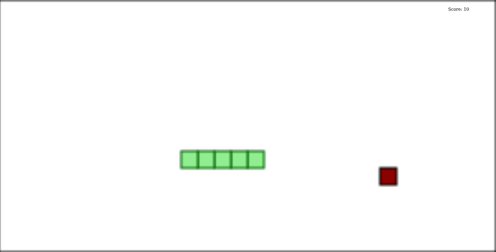

# What is this project

I had a technical test where they asked me to make a little snake and initially I did it with JS Vanilla, but I wanted to take it to the next level to test my skills and have a simple but interesting project to show on my github, below is a list of things implemented and to implement:

### Done
- [x] React
- [x] Next (YOLO)
- [x] Typescript
- [x] Eslint (Standard)
- [x] Github Actions (Linter runner)
- [x] Deploy vercel

### Coming Soon
- [ ] Improve full screen
- [ ] Finish refactoring the view logic
- [ ] Pre-commit
- [ ] Unit Testing
- [ ] Run Tests with Github Actions
- [ ] StoryBook
- [ ] Atomic design (Create more components)
- [ ] Home Page
- [ ] Improve Game Play
- [ ] Improve graphics

## Screenshots

### v1

- 
- 
- 

## Getting Started

First, run the development server:

```bash
yarn dev
```

Open [http://localhost:3000](http://localhost:3000) with your browser to see the result.

## Learn More

To learn more about Next.js, take a look at the following resources:

- [Next.js Documentation](https://nextjs.org/docs) - learn about Next.js features and API.
- [Learn Next.js](https://nextjs.org/learn) - an interactive Next.js tutorial.

You can check out [the Next.js GitHub repository](https://github.com/vercel/next.js/) - your feedback and contributions are welcome!

## Deploy on Vercel

The easiest way to deploy your Next.js app is to use the [Vercel Platform](https://vercel.com/new?utm_medium=default-template&filter=next.js&utm_source=create-next-app&utm_campaign=create-next-app-readme) from the creators of Next.js.

Check out our [Next.js deployment documentation](https://nextjs.org/docs/deployment) for more details.
